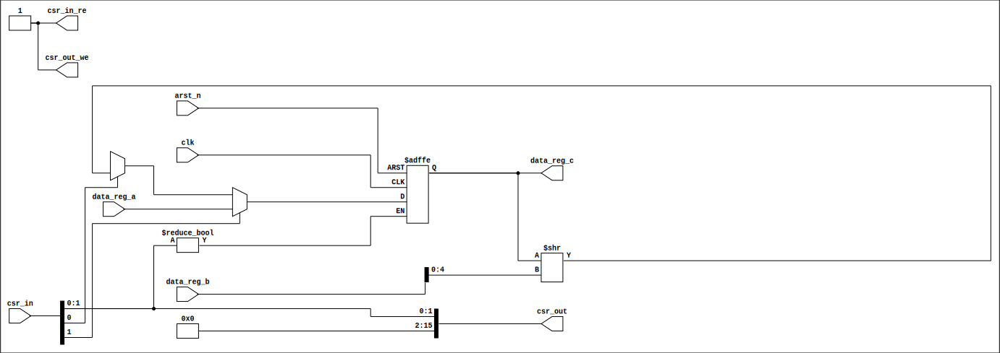

# semicolab-ip-tile-precheck

 

---

**Shift Register Tile** · Roman Lugo · `shift_reg_tile` · Shuttle: -

32-bit shift register with parallel load.
Supports right shift by variable amount and synchronous parallel load.

---

## Ports

<table>
<tr><td><code>csr_in[0]</code> — shift enable</td><td><code>csr_in[1]</code> — load enable (takes priority over shift)</td></tr>
<tr><td><code>data_reg_a</code> — parallel load data (32-bit)</td><td><code>data_reg_b</code> — shift amount (bits [4:0], 0-31)</td></tr>
<tr><td><code>data_reg_c</code> — register output (32-bit)</td><td><code>csr_out</code> — mirrors csr_in[1:0] as status</td></tr>
</table>

## Usage guide

Assert csr_in[1] to load data_reg_a into the register.  
Assert csr_in[0] to shift right by data_reg_b positions.

---

## Precheck result

| Stage | Result |
|---|---|
| Connectivity | PASS |
| Synthesis | PASS |
| Cells | 236 |
| **Status** | **✅ PASS** |

Last run: `run-016` · Commit: `2f1e400` · 2026-04-20

---

## Netlist

📄 [Datasheet](docs/datasheet.pdf) · 📊 [results.json](docs/results.json)
